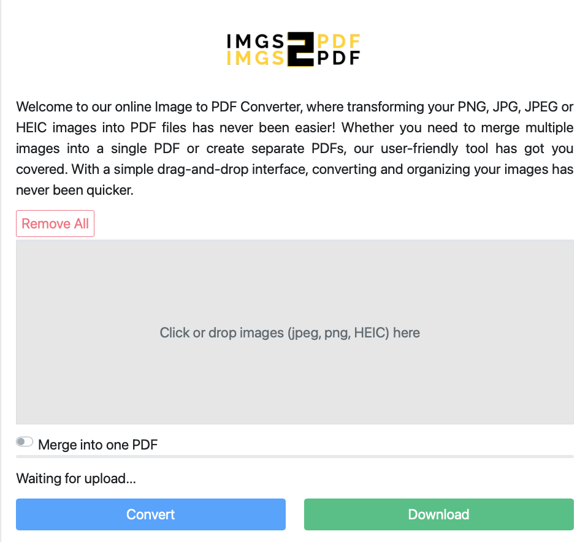

# IMGS2PDF

IMGS2PDF is a simple, user-friendly online tool that converts various image formats (PNG, JPG, JPEG, HEIC) to PDF files. It is meant to be a toy project I have done for both portfolio purposes, and an actual real life frustration with pdf conversion of images 😄.

  

## Features

- Convert PNG, JPG, JPEG, and HEIC images to PDF
- Merge multiple images into a single PDF
- Create separate PDFs from multiple images
- User-friendly drag-and-drop interface

## Tech Stack

This project is built using standard Node.js technologies. 

- Node.js
- Express.js (assumed for the backend)
- Vanilla JavaScript (for frontend interactions)
- HTML/CSS for the user interface

## Development

To set up the project locally:

1. Clone the repository
2. Install dependencies with `npm install`
3. Start the development server with `npm start`

## Contributing

This project is currently maintained as a personal portfolio piece, it may have bugs. However, suggestions and feedback are always welcome. Feel free to open an issue if you have any ideas for improvements.

## License

MIT Licence
